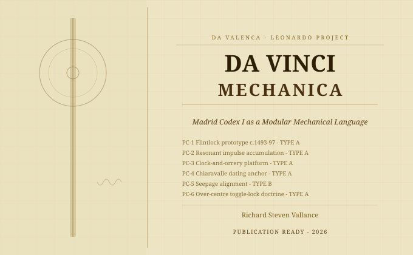

# Da Vinci Mechanica

## Madrid Codex I — Modular Mechanical Architecture

> *Corpus Leonardianum Universale — Grammatica Naturae, Lex Motus, et Ars Vivens*

**Author:** Richard Steven Vallance (Da Valenca)
**Parent Ecosystem:** [da-vinci-ultimatium](https://github.com/richievallance/da-vinci-ultimatium)
**Constitutional Classification:** Validated Engineering White Paper
**Publication Status:** 🟢 Core paper deposited · Companion extension deposited · DOI pending final release decision
**Evidence Types:** TYPE A / TYPE B

---

## Deposited Content

| Document | Description | Status |
|---|---|---|
| `DaValenca_Mechanica_WhitePaper_2026.md` | Core white paper — Chapters I–VIII, 40-transcript appendix, bibliography | ✓ Deposited |
| `docs/Da_Vinci_Mechanica_Extension_Chapters_VIII_X_RSV_2026.docx` | Companion extension — Chapters VIII–X, full codex synthesis | ✓ Deposited |
| `docs/Da_Vinci_Mechanica_Extension_Chapters_VIII_X_README.md` | Summary of extension contents | ✓ Deposited |
| `CITATION.cff` | Citation metadata | ✓ Present |
| `LICENSE` | CC-BY 4.0 | ✓ Present |
| `metadata.json` | Publication metadata | ✓ Present |
| `zenodo.json` | Zenodo package | ✓ Present |
| `hashes.txt` | SHA-256 integrity hashes | ✓ Present |

---

## Abstract

This paper argues that Codex Madrid I is best understood not as a miscellaneous notebook of mechanical sketches, but as a structured corpus of reusable engineering modules whose coherence emerges when the manuscript is read simultaneously at three levels: text as demonstration, reverse folio sequence as instruction, and marginal note as governing law.

The central thesis: Leonardo reached a level of mechanical integration far more systematic than is usually acknowledged. The present reconstruction does not invent a machine absent from Leonardo; it integrates modules demonstrably present in distributed form.

---

## Six Priority Claims

| ID | Claim | BNE Source | Type |
|---|---|---|---|
| PC-1 | Flintlock prototype c.1493–97 — 115 years before le Bourgeoys | BNE 5907 | TYPE A |
| PC-2 | Resonant impulse accumulation — theoretical basis of escapement physics | BNE 5911 | TYPE A |
| PC-3 | Combined clock-and-orrery platform; lunar gear cascade 1:29.5 | BNE 5902/5906/5890 | TYPE A |
| PC-4 | Chiaravalle abbey clock as precision dating anchor | BNE 5892 | TYPE A |
| PC-5 | Seepage alignment as intentional design registration | Madrid I | TYPE B |
| PC-6 | Over-centre toggle-lock doctrine | BNE 5955 | TYPE A |

---

## Evidential Limitations

- Analysis covers f.0r–f.25r (Batches 1–5, approximately 26% of the 192-folio codex)
- Folios f.36v–f.43r are physically missing from Madrid Codex I
- All claims require independent validation against the full codex
- Priority claims are registered but not yet peer reviewed

---

## DOI

Pending. DOI will be assigned at formal release. See [da-vinci-ultimatium](https://github.com/richievallance/da-vinci-ultimatium) DOI registry.

---

## Legal Notice

© 2026 Richard Steven Vallance. All Intellectual Property and Copyright Reserved.
*Da Valenca — Leonardo Project, United Kingdom*
